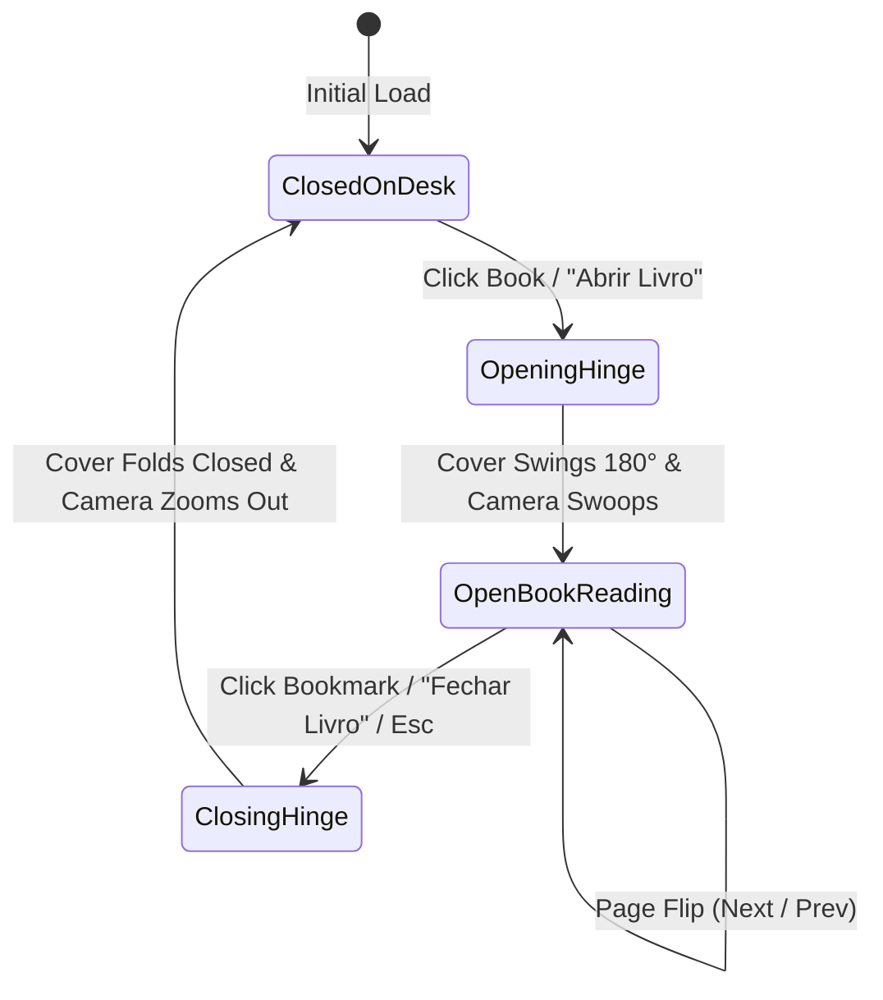

# Specification: 3D Book UI Experience (Three.js & Hybrid CSS3D)

## 1. Executive Summary & Vision

This specification defines the immersive **3D Book experience** for **Plateia Imaginária**, combining **Three.js WebGL** (physical desk, leather blotter, hardcover book geometry, realistic lighting, and contact shadows) with **CSS3DRenderer** (embedding live, crisp Svelte/HTML pages directly onto the 3D book surfaces).

The core premise:
1. **Initial Entry:** The reader sees an executive hardcover book **laid down flat on a study desk / reading board** equipped with a stitched leather blotter pad.
2. **Opening Transition:** Upon clicking "Abrir Livro" (or the book cover), the front cover physically lifts along the central spine hinge and swings 180° open to rest flat on the left desk surface, while the camera smoothly swoops in from the overview to an optimal reading inclination (~58° angle).
3. **Reading Mode (The Single Page):**
   - When open, the book shows **one real 3D page** (the recto): a subdivided sheet with two textured faces, real paper thickness, a curved gutter and a soft arch, lit and shadowed like the rest of the scene.
   - The camera frames that single page, which keeps the layout identical on desktop and mobile.
   - All reading chrome lives on the page itself: a top bar (`Sumário` button, centred chapter label, `Fechar` button), the flowing chapter content, a progress footer (`Página NN de MM`, progress bar, percent) and corner turn buttons (`< Anterior` / `Próxima >`).
   - **Left Page (Verso):** removed. Its frontispiece, bookmark ribbon and progress meter were folded into the single page so there is only one surface to frame, paint and make tappable.
   - **Surroundings:** The rich walnut wood desk, stitched leather blotter, and studio lighting remain visible around the book.
4. **Closing Transition:** Clicking the silk bookmark ribbon (or pressing `Esc`) smoothly swings the cover back over to close with a gentle thud sound, returning the camera to the desk overview.

---

## 2. Visual Philosophy & Environment

### 2.1 The Reading Desk & Setting
- **The Desk / Board:** A rich walnut wood surface with natural longitudinal grain bands and satin sheen, providing warmth and grounded physicality.
- **The Blotter Pad:** An executive dark charcoal leather desk mat (`#1E2023`) with rounded corners and gold/buff perimeter stitching (`#B39150`), anchoring the book in a private study environment.
- **Lighting & Shadows:**
  - Soft warm ambient light (`#FFF6EA`).
  - Primary directional key light from upper right with PCF soft shadows, projecting realistic contact shadows beneath the book and pages.
  - Subtle cool fill light from the left side.
- **Book Aesthetic:**
  - Charcoal/slate linen hardcover (`#1A1C21`).
  - High-res procedural gold-foil debossed front cover featuring the eye/spotlight motif, geometric borders, and serif typography.
  - Realistic layered paper block edges with authentic page lines.

---

## 3. Architecture & Technical Strategy

### 3.1 One Real 3D Page with a Projected DOM Control Layer
- **WebGLRenderer (Canvas) — the whole book:**
  - Renders the physical world: wooden desk, stitched leather blotter, hardcover boards, rounded spine, layered paper block, **and the pages themselves**.
  - **Every page is a permanent physical sheet** (`pageGeometry.ts` + `pageStack.ts`): a subdivided box spanning spine → fore-edge, pre-painted once and kept for the whole session. Turning a page moves that sheet from one pile to the other — nothing is repainted mid-flight, so the swap cannot pop.
  - **Front** carries the page content; **back** carries one shared static design (the book's mark), so the left pile always looks intentional and never shows stale page content or dead buttons.
  - Each sheet keeps a resting **gutter curve** (dipping into the spine, arching towards the fore-edge) so paper never looks like a flat plane.
  - Pile steps (0.007) clear the paper thickness (0.005) so neighbouring sheets can never interpenetrate; backward landings touch down a hair above the pile and settle imperceptibly.
  - Resting heights glide toward their targets instead of snapping, so the pile re-indexing at each commit reads as a breath, never a tick.
  - The paper block's top surface is curved with the *same* profile, so the page sits flush on it. The cover stays a clean flat board.
  - The page receives the same lighting and casts contact shadows, exactly like the rest of the book. Its face materials skip tone mapping so the baked type keeps its contrast.
- **Baked page content (`pageTexture.ts`):**
  - A Canvas 2D layout engine paints each page from the same `BookPage` data (top chrome, title, subtitle, epigraph, drop-capped paragraphs, callouts, index with dot leaders, references, author cards, dilemma options, progress footer, navigation).
  - Content is measured first, then scaled down when a chapter would otherwise spill past the edge of the paper.
  - The backing store is rendered at 2× (`PAGE_TEX_SCALE`) with mipmapping and 16× anisotropic filtering for crisp close-up type.
  - The painter also reports the rectangle of every interactive element.
- **DOM control layer (`PageInteractionLayer.svelte` + `hitProjection.ts`):**
  - Real `<button>` elements are projected through the camera onto the page surface each frame, so navigation, the table of contents, index links and dilemma answers keep 100% native DOM behaviour (focus, keyboard, screen readers).
  - **Why not `CSS3DRenderer`?** Browsers do not hit-test reliably inside a `transform-style: preserve-3d` subtree, so a DOM page laid over the book silently swallows every click. Projecting onto a plain 2D overlay removes that whole class of bug and drops a dependency on the CSS3D examples.
- **Benefits:**
  - **The pages are physically in the 3D world**: they bend, catch light and cast shadows as the camera moves.
  - **Native interactivity** is preserved, including keyboard navigation and focus outlines.
  - **Crisp typography** at 1024×1430 per page, with mipmapping and anisotropic filtering for angled views.

---

## 4. State Machine & User Journey

### 4.1 State 1: Closed on Desk (Overview)
- **Position:** Book lies closed horizontally on the leather blotter.
- **Camera:** Elevated overview angle (`[0, 3.8, 3.4]`, looking at `[0.2, 0, 0]`).
- **Interactions:** Subtle mouse parallax tilt responding to cursor movement; clicking anywhere on the book or the "Abrir Livro" button triggers opening.

### 4.2 State 2: Opening Transition
- **Cover Hinge:** Front cover lifts and rotates just past 180° along the spine hinge so its far edge settles onto the desk instead of floating.
- **Page Reveal:** The single reading page lives inside the closed book and appears as the cover lifts.
- **Camera Swoop:** Camera interpolates from the desk overview to a near-overhead framing of the single page. The framing is solved per viewport so the page always fits, identically on desktop and mobile.
- **Audio:** Synthesized hardcover opening and paper rustle sound effect (`playBookOpenSound()`).

### 4.3 State 3: Open Book Reading Mode
- **Single-page structure:** top chrome (`Sumário`, chapter label, `Fechar`), flowing chapter content, progress footer (`Página NN de MM`, bar, percent), corner turn buttons (`< Anterior` / `Próxima >`).
- **Page Flip Mechanics — real bending paper, both directions:**
  - The sheet rotates about the spine hinge while its centreline is integrated along an arc, so the free edge **trails behind** the hinge and the paper visibly curls (`applyTurnPose`).
  - Curl, bow and gutter all peak mid-flight and relax at both ends, so the sheet starts exactly on the resting page and lands exactly on the page it reveals.
  - The resting page swaps to the incoming page at the turn midpoint (sheet edge-on), which makes the hand-off seamless going forward and back.
  - Driven by `bookStore.flipProgress` (0 → 1 on next, 1 → 0 on prev), so the audio (`playPaperFlipSound()`) and the geometry stay in lockstep.

### 4.4 State 4: Closing Transition
- **Trigger:** Clicking the silk bookmark ribbon or pressing `Esc`.
- **Motion:** Cover swings back over from left to right, closing onto the paper block with a soft thud sound (`playBookCloseSound()`); camera swoops back to overview.

---

## 5. UI Controls Summary

| Control | Position | Function |
| :--- | :--- | :--- |
| **Sumário Button** | Top-left of the page | Opens the Table of Contents modal |
| **Fechar Button** | Top-right of the page | Closes the book and returns to desk overview |
| **Próxima (Next)** | Bottom-right corner of the page | Advances to next page with paper flip SFX |
| **Anterior (Previous)** | Bottom-left corner of the page | Retreats to previous page with paper flip SFX |
| **Index rows** | Recto of the index page | Jumps straight to a chapter |
| **Dilemma options** | Recto of an interactive page | Records the answer (persisted) and reveals the analysis |
| **Audio Toggle** | Peripheral top-right corner | Mutes/unmutes sound effects globally |

### 5.1 Keyboard & Pointer

| Input | Action |
| :--- | :--- |
| `→` / `PageDown` | Next page |
| `←` / `PageUp` | Previous page |
| `Esc` | Close the book (or dismiss the table of contents) |
| `Enter` / `Space` | Open the book while it is closed |
| Horizontal swipe | Next / previous page |
